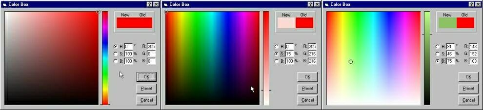



## A Standard ColorPicker \(Updated \.\.\.\. More Good Looking Interface\)

### Description

A ColorPicker that is similar to Adobe photoshop & Corel Color Picker.

This was actually developed for my Paint Programme.

It is faster and have mainly 3 modes of Color spaces and Preset mode containing safe palette and custom colors.

The color algorithms have been optimized for speed.

The same code have been translated into C++ and posted in PSC. see 'Great ColorPicker'. See this also and notice the speed difference between C++ and VB that use same algorithm.

All Suggestions and VOTES are welcome.
 
### More Info
 

             |
---                |---
**Submitted On**   |2002-01-08 10:44:50
**By**             |[Saifudheen A A](https://github.com/Planet-Source-Code/PSCIndex/blob/master/ByAuthor/saifudheen-a-a.md)
**Level**          |Intermediate
**User Rating**    |4.9 (107 globes from 22 users)
**Compatibility**  |VB 4\.0 \(32\-bit\), VB 5\.0, VB 6\.0
**Category**       |[Graphics](https://github.com/Planet-Source-Code/PSCIndex/blob/master/ByCategory/graphics__1-46.md)
**World**          |[Visual Basic](https://github.com/Planet-Source-Code/PSCIndex/blob/master/ByWorld/visual-basic.md)
**Archive File**   |[A\_Standard47133182002\.zip](https://github.com/Planet-Source-Code/saifudheen-a-a-a-standard-colorpicker-updated-more-good-looking-interface__1-30527/archive/master.zip)

